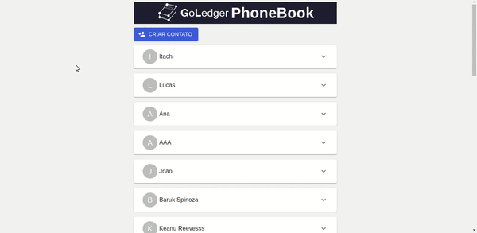

# GoLedger Challenge

## Overview



## How to run
1. Clone the repository
```
git clone https://github.com/caiooliv/goledger-challenge-web
```
2. Enter the directory
```
cd goledger-challenge-web/goledger-challenge/
```
3. Install dependecies
```
yarn
```
4. Run application
```
sudo yarn start
```
